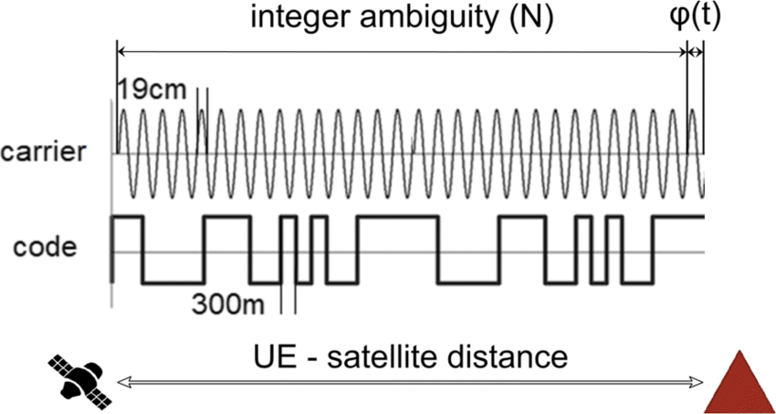

## What brand of GPS to be used and Why?
**Ublox** is go to GPS solution, because od its non chinese origin. We can use UCenter to make changes to GPS Configuration. UBlox is of Swiss Origin.

## What are Satelite Bands and in which does Navic operates?
L1, L2 and L5 frequencies. L1 - GPS / Glonass. Navic works on L5 and S band. S band prone for interference with cellular and wifi networks. As Navic operates at 35000m height. Signal strength week.
> Navic-01 developed by isro ( which is L1, L5 and S frequencies receivers)
So any receivers of L5 frequencies can get navic signal.
> Gagan - geo stationary satellite for accuracy ( Satellite based Augumenation System) especially used for aircrafts. For ionosphere correction 

## What is Satelite Bases Augmentation System (SBAS)?
SBAS (Satellite-Based Augmentation System) → Uses satellites like GAGAN (India), WAAS (USA), EGNOS (Europe) to send free correction data. It uses geostationary satellite to send corection data.

## What is CORS Network?
CORS stands for Continously Operating Reference Station. Surevey of India operates more than 1500 Station for weather an GPS corrections. Using these corrections we can improve location accuracy. It is transmitted through internet. so we need to add IP address of CORS network to our UCenter software, to do live corrections.
> https://cors.surveyofindia.gov.in/index.php

## What are various types of Antenna?
- Hellical
- Patch type
- Multi stacked patch ceramic antenna (square size of path decides which frequency it is designed for
better for compact)
- Dome antenna ( external flying saucer antenna) better for multiband
- Thin film type
- Circular plate type
- Rod type
> Taoglas has good collection of gps antennas in various form factor and type ( pcb, flex, patch type, ceramic type etc )

## What are major technologies used in GPS location?
- Carrier Phase Measurement. Very Accurate. Used in Real Time Kinematics and Post Processing Kinematics.
- Pseudo Random Code. Low Cost GPS



*Carrier Wave Measurement vs Pseudo Random Code*

## UBlox Formats
UBlox GNSS Receiver Modules can be configured to output multiple formats simultaneously on the same or different ports.


We can configure each communication port independently to output different protocols, or combination of protocols.

- UART1 : NMEA only (For TinyGPS++ code)
- UART2 : UBX only(for RTK corrections or advanced data)
- USB : NMEA + UBX + RTCM (for configuration/ debugging).

Default Protocol Settings on Port are as under

| Communication Port | ZED F9P |NEO M9N |
| --- | --- | --- |
| USB | NMEA, UBX, RTCM3| NMEA, UBX |
| UART1 | NMEA, UBX | NMEA, UBX |
| UART2 | NMEA, UBX| NA |
| SPI | UBX | UBX |
| I2C | UBX | UBX |

### U Center Software configuration

View -> Messages View 

CFG -> PRT (Port Configuration)

Select Target Port (UART1, UART2, I2C, USB etc)

Enable Protocols (UBX, NMEA, RTCM3 (if needed for RTK))

> TinyGPS++ library can only read and understand NMEA statements.

## NMEA Protocol
NMEA Protocol developed by National Marine Electronics Association for Commninication. It uses ASCII text. 

```NMEA
$GPGGA,123519,4807.038,N,01131.000,E,1,08,0.9,545.4,M,46.9,M,,*47<CR><LF>
```

- $ : Start Character
- GP : (GP - GPS, GL -  Glonass, GN - Multiple Sytems etc)
- GGA : Sentence type
- 23125, 1231 : comma seperated data 
- *47 : checksum (asterisk + 2 HEX digits)
- <CR><LF> : End (carriage return + Line feed)

### Sentence Type

| Type | Full Name | Contains |
| --- | --- | --- |
| GGA | Global Position System Fix Data | Position, altitude, time, satellites |
| RMC | Recommended Minimum Navigation | Position, speed, date, time |
| GSA | GPS DOP and Active Satellites | Satellite IDs, accuracy metrics |
| GSV | GPS Satellies in View | Satellite Details, signal Strength |
| VTG | Track Made Good and Ground Speed | Speed Heading |
| GLL | Geographic Position | Latitude and Longitude Only |

> TinyGPS++ Library does all tasks, such as parsing, checksum validation, data conversion and returns data like latitude, longitude, satelite fix etc.

## UBX Protocol
UBX is U Blox proprietary binary protocol. Unlike NMEA (text), UBX is Binary data.

```UBX
NMEA: $GPGGA,123519,4807.038,N,01131.000,E,1,08,0.9,545.4,M,46.9,M,,*47     (70+ bytes of ASCII text)

UBX:  0xB5 0x62 0x01 0x07 ... (20-30 bytes of binary data)

[SYNC1] [SYNC2] [CLASS] [ID] [LENGH] [PAYLOAD] [CHECKSUM]
```

Every UBX messages starts with 2 bytes
- 0xB5 (181 decimal) - SYNC1 Char
- 0x62 (98 decimal) - SYNC2 Char
- It is similar to NMEA $

UBX Messages are organized by CLASS and ID

| Class | HEX | Category |
| --- | --- | --- |
| NAV | 01 | Navigation (Position, velocity) |
| RXM | 02 | Receiver (satellite info) |
| INF | 04 | Information |
| ACK | 05 | Acknowledge |
| CFG | 06 | Configuration |
| Mon | 0A | Monitoring (system status) |
| TIM | 0D | Timing |
| MGA | 13 | Multiple GNSS Assistance |
| LOG | 21 | Logging |

For each CLASS there are several ID. Consider NAV CLASS (0x01)

| ID | HEX | Message Name | Contains |
| --- | --- | --- | --- |
| POSLLH | 02 | Position (Lat, Lon, Height) | Lat, Lon, Alt |
| STATUS | 03 | Receiver Status | Fix Type, flags |
| PVT | 07 | Position, Velocity, time | Everything (most used) |
| TIMEUTC | 21 | UTC TIme | Date and time |
| SVINFO | 30 | Satellite Info | Signal Strength per satellite |

> Sparkfun Library (Sparkfun_u-blox_GNSS_Arduino_Lirary_V3.h) does all the heavy lifting and returns latitude, latitude and all. 

## RTCM3 Protocol

RTCM 3 stands for Radio Technical Commision for Maritime Serivices, Version 3. It is binary protocol (similar to UBX Protocol) used for High Precision GPS Corrections.

```txt
Base Station (knows exact position) [conside U Blox ZED F9P]
        |

Observes Satellite Errors (Like CORS Network) [ Base Sation to be Fixed]
        |

Sends RTCM3 Corrections (By Radio, Internet, Wifi, Bluetooth, Lora)
        |

Rover / Receiver (veh/ hand held GPS) [ZED F9P]
        |

Applies corrections
```

RTCM3 Syntax

```txt
[PREAMBLE] [LENGTH] [MESSAGE] [CRC]
```

- Preamble : Every RTCM3 Message  starts with 0xD3 (0xB5, 0x62 for UBX, $ for NMEA)

- Lenth : Number of Bytes of Message Data.

- Message : contains correction data for each satellite

- CRC : Checksum


