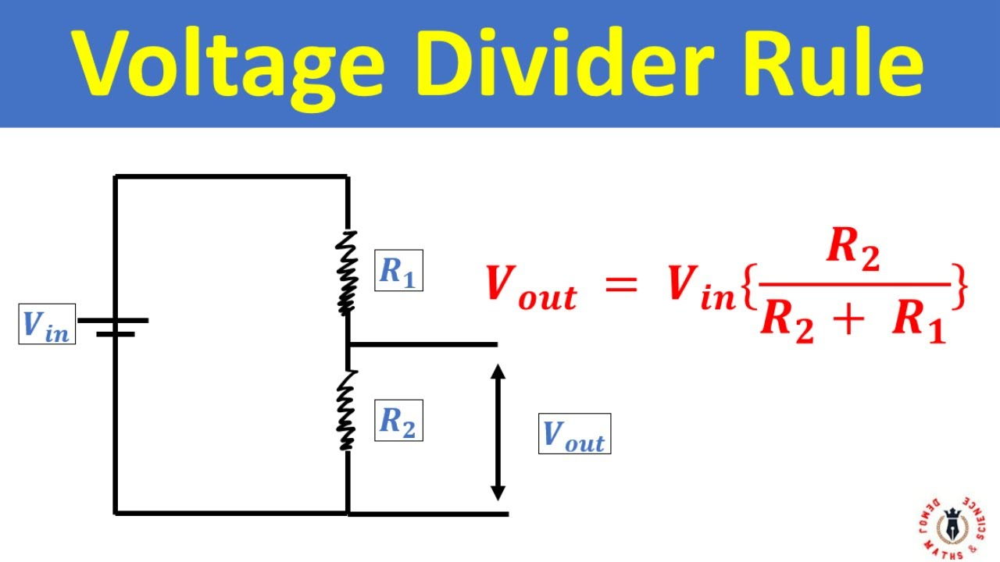
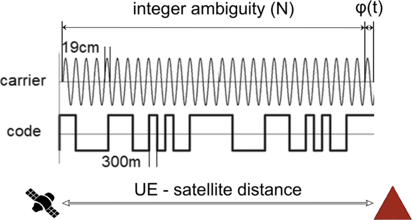

## Computer Basics
## Command Prompt Reference
| Symbol                   | Feature |
|---|---|
| dir                      | list folder and files in current folder |
| cd                       | show current directory                  |
| cd foldername            | go into folder                          |
| cd ..                    | go up one level                         |
| cd \                     | go to root of device                    |
| cls                      | clear screen                            |
| mkdir foldername         | create folder                           |
| rmdir foldername         | remove empty folder                     |
| rmdir /s foldername      | remove folder + contents                |
| del file.txt             | delete file                             |
| copy file1.txt file2.txt | copy file                               |
| move file1.txt D:\backup | move/rename file                        |
| rename old.txt new.txt   | rename file                             |
| C:                       | switch to C drive                       | 
| D:                       | switch to D drive                       |
| echo Hello_World         | print text                              |
| echo %username%          | show username                           |
| echo %date %time%        | show date and time                      |
| help                     | list all commands                       |
| help command             | details of a command                    |
| exit                     | close command prompt                    |

## Editor
## Refactor
When we change folder structure or rename files, it associated relative paths also changes, for example when we insert images in markdown files, if we change folder structure, then we need to manually change all path instances where images used. 

Refactor helps in automating naming paths / relative paths / references of files used in entire project. saves lot of time and provide flexilibity to developer for creating better folder structure as project develops.

## Softwarp
It helps in wrapping long text lines to next line automatically.

> Setting -> Editor -> General -> Softwarp
## Marddown
## Markdown Reference
| Symbol                        | Feature                                       | 
|-------------------------------|-----------------------------------------------| 
| #                             | Heading (H1)                                  |
| ##                            | Heading (H2)                                  |
| ###                           | Heading (H3)                                  |
| ####                          | Heading (H4)                                  |
| -                             | List (Bullet Form)                            |
| \>                            | Highlight Paragraph                           |
| **                            | Bold                                          |
| *                             | Italic                                        |
| ```python                     | Python code                                   |
| ```shell                      | Shell Code                                    |
| \[link](https://google.com)   | link                                          |
| \[anchor](#anchor-navigation) | With in Page Navigation                       |
| \!\[img.jpg](path/to/img)     | Images                                        |
| \                             | Backslash for New line in Highlight Paragraph |
## Anchor Navigation
It helps creation of Table of contents for a markdown page and takes to desired paragraph.

All headings are converted to links. Example '## Anchor Navigation' link will be ##anchor-navigation. Special characters are removed.
## 3D Model
## Autodesk Fusion Reference

| Key                         | Feature                                                          |
|-----------------------------|------------------------------------------------------------------|
| shift + Mouse Middle Button | Orbit                                                            |
| insert Button               | Toggle between insert (line cursor) and overwrite (block curser) |


## Key features
- Thread
- Revolve
- Parametric Design ( We can go to any step of design process and change design ).
> Example - To make a cube of 10 x 10 Cm, in Step 1 - we draw square of size 10 x 10 cm, in step 2 we extrude it by 10 cm. In the future, design changes to 8 x 8 cm. we can click on step 1 (In bottom window) change dimensions, it automatically changes further steps.

## Python

## Decorator
Decorate mean to enhance the appearance of something by adding something unessential.
- Painting building
- Adding lights, screens etc to event

> Decorator in Python implies - a function that takes another function as an argument and returns a new function with enhanced functionality.

## Virtual Environments
The more Python projects you have, the more likely it is that you need to work with different versions of Python libraries, or even different version of Python itself. Newer versions of libraries for one project can break compatibility in another project.

Virtual environments are used to create independent groups of Python libraries, one for each project. Packages installed for one project will not affect other projects or the operating system’s packages.

## Web Apps Python Library

Streamlit | For Single Page Web Apps ( Interactive)
--- | --- 
Gradio | Mainly used displaying ML Models
Flask | Multiple Web Pages, has routing feature 

## Python Library for OCR

pytesseractOCR | Light | Less Accurate
--- | --- | ---
EasyOCR | Medium | Good Accuracy
PaddleOCR | Heavy | Best Accurarcy

## Best Practises of Python
#### Requirements File 
It is good method to use requirements file to use for listing dependency library. In future if we want to rerun program we can uses same set of library which were functional.

#### Virtual Environment 
It is good practise to create separate Virtual environment for each project so that has its own dependent library in separate  folder can be added to gitignore.

#### Version Control 
To test and add to Main Brach.

## What is IPython?
IPython stands for Interactive Python is an enhanced interactive Python shell designed for interactive computing and exploratory data analysis.

## What is pathlib?
Pathlib is python library introduced from python 3.4, replacing os.path. It is currently the recommended way to operate and use files and directory in python.

## What is pyenv? How does it differ from venv?
pyenv is a Python version management tool that lets you easily install, switch between, and manage multiple Python versions on your system.

venv is Python's built-in virtual environment tool that creates isolated environments for managing packages and dependencies.

## OpenCV

```python
import cv2

# Read the image from directory
image = cv2.imread("image.jpg") 
# we need to pass path as argument

# Blur the image
# Argument - Kernal Size (ksize) for intensity of blur
blurred = cv2.blur(image, (50, 50))

# Write the image to directory
# Arguments 2 required
# Output file name, image to write
cv2.imwrite("test.png", blurred)

# Crop the image and display it
# opencv does not crop support crop option on image directly, we can slice it to another image variable
# sliced_image = image[x1:y1, x2:y2]
sliced_image = image[240:450, 680:900]

# Read and process video file
videocapture = cv2.videoCapture("video.mov")

while videocapture.isopened():
    # intialize variable success, frame (input frame from video)
    # videocapture.read provide two outputs

    success, frame = videocapture.read()
    if success:
        # display frame
        cv2.imshow("test", frame)
        if cv2.waitkey(2) & 0xFF == ord("q"):
            break
    else:
        break # break the window one frames

        
# Visualize the image
# Argument 2 required
# window name and image
cv2.imshow("test", blurred)

# Display untill key press
cv2.waitkey(0)

```


## Machine Learning
## What is FLOPS (B)
- Hardware FLOPS stands for Floating-Point Operations Per Seconds.
- Model FLOPS stand for Floating Point Operations
- How many billion mathematical operations the model performs for one forward pass (one input image)
> FLOPs = how much work the model does when you give it 1 image

## Public Datasets
- ImageNet Dataset has 14 million images accross 20k Categories
- COCO (Common Objects in COntext) Dataset has 80 different type of object, it comes in various sizes
- CIFAR-10 / 100 (Canadian Institute For Advanced Research) contain 60k images accross 10 / 100 categories of 32 x 32 Pixels.
- DOTA (Dataset for Object deTection in Aerial Images) has 15 Categories
- fashionMNIST

## What is TorchVision?
TorchVision is a component of PyTorch, which provides pre-trained models, datasets and utility functions to simplify the development process.
- **Pre-trained Models** : ResNet, VGG, Inception etc
- **Datasets** : CIFAR-10. CIFAR-100, COCO, MNIST etc
- **Data Tranformtion** : Image Resizing, Cropping, Rotation, Normalization, Enhancing the Quality etc
- **Object Detect and Segmentation** : Faster R-CNN, Mask R-CNN models etc

## What is yaml ?
YAML is to create configuration files. It's recommended that configuration files be written in YAML rather than JSON, even though they can be used interchangeably in most cases, because YAML has better readability (like Python Syntax, white space) and is more user-friendly.  


```yaml
# A sample yaml file
company: spacelift
domain:
 - devops
 - devsecops
tutorial:
  - yaml:
      name: "YAML Ain't Markup Language"
      type: awesome
      born: 2001
  - json:
      name: JavaScript Object Notation
      type: great
      born: 2001
  - xml:
      name: Extensible Markup Language
      type: good
      born: 1996
author: omkarbirade
published: true
```

## What is Epoches ?
In machine learning, an epoch refers to one complete pass through the entire training dataset where every data sample is passed through the model and its parameters are updated based on the calculated error. 

The training process requires multiple epochs, allowing the model to improve iteratively by adjusting its parameters based on the calculated error.

## What are Weights?
**Purpose:** During forward propagation, inputs are multiplied by their respective weights before being passed through an activation function. This influences how strongly each input contributes to the final output. 
> Like, we did in course grading prediction model, where each parameter like (married or unmarried, trade, state etc ) each column or parameter to be multiplied with certain weight based on its influence on final outcome.

## The Activation Function (Decision Making)
The activation function is like your brain's final decision-making step. It takes that total influence and decides:

- If the number is high enough → "Yes, go outside!"
- If it's too low → "No, stay inside"

Think of it as your personal threshold. Maybe you go outside if the total is above 50, stay inside if below.

#### Learning Mechanism
During training, weights are updated iteratively through optimization algorithms like gradient descent to minimize the difference between predicted and actual outcomes.

## What is Bias?
Even before anything happens in our day, we might naturally lean toward being happy or grumpy. Thats our "bias" - out starting emotional state. Then daily events (inputs) push us up or down from there.

y = mx + b
- m = weight (slope)
- x = input
- b = bias

## What is a Quantized Model?
A quantized model is a compressed version of your trained model, where floating point numbers (32-bit) are converted into smaller numbers, like 8-bit integers (int8).

#### Types of Quantization 
- Dynamic Quantization	Only weights are quantized (int8)	Good, fast, easy
- Static Quantization	Weights + activations are int8	More accurate but complex
- Quantization Aware Training (QAT)	Trained with quantization in mind	Best accuracy, slow to train

For YOLO, dynamic or static quantization is often used after training.

## What is ONXX
ONNX stands for Open Neural Network Xchange
 It’s like exporting a Word document as PDF — any device can open it the same way.

## What Are Visual Question Answering (VQA) Models?
Visual Question Answering (VQA) Models takes image and text (prompt) as input, and outputs text based answer.

> What is the color of car in image?
> Is person on bike wearing helmet?

It is multi model arcitecture. 
CNN / Tranformer models for image detection.
LLM models for text generation.
It combines both of them and produce results.

- Gemma 3n
- PaliGemma
- LLaVA
- CogVLM
- InstructBLIP
- DonutBase
- BLIP-2


ReLU - Rectified Linear Unit
Back Propagation to improve accuracy to self learn
Neurons
    input layer
    hidden layer ( apply formula to input in each layer )
    output layer

torchvision is python package consists of popular datasets
Transformers is type of nueral network deals with sequential data. (Like Text, Voice etc) process data in Parallel (faster)
    Self Attention Mechanism ( If you are in busy room, trying to listen to voice )
    This method pays more attention to relevant information, and gets meaningful output
   Think about how you understand this sentence: "The trophy wouldn't fit in the suitcase because it was too big." What does "it" refer to — the trophy or the suitcase? For humans, context makes it clear that "it" refers to the trophy. Transformers can make these connections too, thanks to their attention mechanism.
 
types of neural network - Transformers, RNN (Recurrent Neural Network), CNN ( Convolutional Neural Network)
GPT is type of Transformer (Generative Pretrained Transformer)

Positional Encoding - Position of word in sentence
    Since the Transformer processes all tokens (words) simultaneously, it needs a way to understand their order. This is where positional encoding comes in — additional information added to each embedding that indicates its position in the sequence. Without positional encoding, the sentence "dog bites man" would be indistinguishable from "man bites dog".

Multi Head Attention 
    Think of multi-head attention like having several people read the same text, each focusing on different aspects:
     One person might focus on syntactic relationships
     Another might capture semantic similarities 
     A third might identify subject-object relationships.

Encoder - Decoder

Softmax Activation Function in Neural Networks
Q.    What is Activation Function in Neural Networks

Embedding - Words to Vectors ( Numbers)
Static Embeddings - GloVe (Global Vector) Word2Vec are certain Techniques
Contextual Embeddings

## Yolo
## What is YOLO?
- YOLO Stands for You Only Look One.
- Created for Faster Computer vision Tasks.
- Ultralytics created YOLO V5, V8 & v11
- YOLO can handle 5 type of tasks
    - Detection
    - Instance Segmentation (seg)
    - Pose / Keypoints (pose)
    - Oriented Detection /  Oriented Bounding Box (obb)
    - Classification (cls)
- Each Type of tasks of Yolo V11 comes in 5 Varients
  
  Model | No of Parameters (M) | Size (MB) | Speed T4 GPU (ms) | FLOPS (B)
  --- | --- | --- | --- | ---
  YOLO V11n | 2.6 | 5.35 | 1.5 | 6.5
  YOLO V11s | 9.4 | 18.4 | 2.5 | 21.5
  YOLO V11m | 20.1 | 38.8 | 4.7 | 68
  YOLO V11l | 25.3 | 49 | 6.2 | 86.9
  YOLO V11x | 56.9 | 109 | 11.3 | 194.9

## Before training custom data on yonov11n.pt, model size is 5.35 mb, after training on aadhar data set size it still the same. Why?
- yolov11n.pt - Pretrained weights — default weights trained on COCO or another base dataset.
- best.pt - Your trained weights — same architecture, but learned parameters updated based on your dataset.

YOLOv11n (nano) has a fixed architecture with ~2.58 million parameters.
So, both files store weights for the same number of layers and tensors.
Only the values of those parameters (weights, biases, batch norms) are different.
This is why both files are ~5.3 MB, but they encode different model behavior.

> Think of it like saving two versions of the same Excel sheet — same format, different data.

> In Aadhar card, licence plate and helmet we are using object detection model.

## Parameter of YOLO Models
 
```python

!yolo task=detect mode=train \
# Basic Building Blocks
  data={dataset.location}/data.yaml \
  model="yolov11s.pt" \
  epochs=100 \ # Number of times it should look at data
  batch=16 \ # Look 16 images at a time, helps in recognition of pattern, better learining
  imgsz=640 \ # Set to 640 x 640 px
  val=True \ # Progress monitoring - Check for validation, check whether model is improving. Like taking practise test while learning
  patience=15 \ # Smart stopping - Stop, if no improvement for 15 rounds
  device=0 \ # GPU
  cache=True \ # Faster training 
  project="improved_detection" \
  name="better_model_v1" \
  plots=True # Visual progress

# Data Augmentation - These are tricks used to make more variations of your images to help the model generalize better.

auto_augment = randaugment # It automatically applies smart image transformations (like rotating, flipping, etc.). Helps model handle real-world variations.

mosaic = 1.0  # Combines 4 training images into one. Helps detect small objects better.

translate = 0.1 # Randomly moves objects by up to 10% of the image size.

scale = 0.5 # Randomly zooms in or out on the object.

fliplr = 0.5 # 50% chance of flipping the image left to right.

erasing = 0.4 # Randomly removes parts of the image to help the model become more robust.

#### Learning Parameters

lr0 = 0.01 # Starting learning rate — how fast the model adjusts its guesses.

momentum = 0.937 # Helps smooth the learning over time.

weight_decay = 0.0005 # Keeps the model from memorizing the training data.

warmup_epochs = 3.0 # For the first 3 epochs, the model starts slowly before speeding up learning.

```

## What is Ultralytics Package?

#### Tasks
- Image Classify (classify)
- Object Detection (detect)
- Image Segmentation (segment)
- Pose Estimation (pose)
- Oriented Bounding Box (obb)


#### Modes
- Model Validation (val)
- Model Tain (train)
- Model Export (export)
- Benchmark (benchmark)
- Object Tracking (track)
- Inference (predict)

#### Ultralytics Solutions

```python

from ultralytics import YOLO

# Load the model
# Argument - path of model
# Lets store intitalization of model in variable named model, so that futher operations can be carried on model variable. In this way we can use it for multiple purposes.
model = YOLO("yolo11n.pt")

# Use different modes
# when we want to see results on image
# argument in predict method show = True
# because it is image it automatically closes
# so we are saving the image
# with save = True
results = model.predict(source="image.png", save = True)

# Extract the results
for result in results:
  print(result.boxes.xyxy)
  # when we are using segmentation model
  print(result.masks.xy)
  # pose model
  print(result.keypoints)

```

We will be using Label Studio for annotation

```console
pip install label-studio
label-studio start
```

auto_annotate

sam model - segment anything model

auto_annotate takes 3 arguments, path to data, detection model, sam model

It is difficult to annotate segmentation data, because we need to create polygon on every object, if we want to segment apple, how accurate can we be, it will be very diffiult, so we make detection labels using label studio, we then pass detection model and auto_annotate model from segment anything model, which creates polygon around each detected object. By this we can easily create segment labels.


       
# Micropython

### Flashing MicroPython onto ESP32
ESP32 boards normally come blank or with the Arduino Bootloader. To run Python, we need to flash MicroPython Firmware (.bin file). We used esptool.py to erase flash and then write the MicroPython Firmware.
> https://micropython.org/download/ESP32_GENERIC/
```shell
machinelearning -m esptool --chip esp32 --port COM3 erase_flash
machinelearning -m esptool --chip esp32 --port COM3 --baud 460800 write_flash -z 0x1000 esp32-20230426-v1.20.0.bin
```
### Pycharm Setup with MicroPython Tools Plugin by Lukas Kremla
Adds a MicroPython Tools panel at the Left Bottom to Pycharm IDE. Lets PyCharm connect directly to ESP32 over USB/COM. Provides a **File System View** so we can see nd manage files stored on the ESP32.

### Connecting the Board
File > Settings > Languages & Frameworks > MicroPython Tools. Enable MicroPython Support.

### MicroPython Stubs
PyCharm didnt recognize special MicroPython Modules (machine, Pin, network etc) Stubs helps in linting and code completion.

### Upload Code
Right click on main.py, upload to MicroPython Device. It copies main.py to ESP32 Flash Storage

### Running Code
Micropython run two special files automatically. boot.py and main.py

### Key Standard Library of MicroPython
| Classes | Usage |
| --- | --- |
| Pin | Control Digital GPIO Pins |
| PWN | Pulse width Modulation (LED dimming, motor speed) |
| ADC | Analog Input (Read Sensor Voltages) |
| DAC | Analog Output (Limited support on ESP32) |
| I2C | Communicate with I2C devices (sensors, OLEDs etc) |
| SPI | Communicate with SPI devices (displays, SD Cards) |
| UART | Serial Communication (GPS, GSM Modules) |
| Timer | Schedule repeated tasks |
| RTC | Real Time Clock (Time Keeping) |

### Colab runs on which OS?
Colab creates Virtual Machines using Ubuntu OS.

### Where does Colab shines?
Colab can be used for Creation of Machine Learning Models, which requires high end GPU. We can leverage benefit of T4 GPU, which is provided for free teir.


## Electronics Basics
### What is Relation between Voltage, Resistance and Current?
The relation between voltage (V), current (I) and resistance (R) is given by Ohm's Law:
> V = I x R

- Voltage (V) measured in volts is like the "pressure" pushing electric charges through a circuit. water pressure.
- Resistance (R) measured in ohms is the opposition to the flow of electric current. Like someone putting / applying pressure on pipe using leg / hand. thickness/narrowness of the pipe. 
- Current (I) measured in Amphere is the flow of electric charges (like water flow in a pipe). in water it is Liters per second. in Electric Current it is Amphere ( 1 A = 1 Coulomb per second ). 1 Couloumb = 6.242 x 10 power 18 electrons.

### What is voltage divider? How resistance reduces voltage? How to calculate voltage?
**Voltage Divider** is a circuit that uses resistors to reduce a larger input voltage to a smaller output voltage. A Voltage Divider consists of two resistors connected in series accross a voltage source. The Output Voltage is taken from the connection point between the two resistors.


**Formula** Vout = Vin x (R2/(R1+R2))
- The output voltage is always a fraction of input voltage
- It R1 = R2, then Vout = Vin /2 (Half the input Voltage)
- Larger R2 relative to R1 gives higher output voltage
- Larger R1 relative to R2 gives lower output voltage
- The circuit works because voltage diveds proportionally based on resistance ratios.

### What is Power?
Power is rate at which energy is transferred, used or converted. Power measured engery per unit time. Measured in watts(W), 1 Watt = 1 Joule per Second.
> Power (P) = Energy / Time

> Power (P) = Voltage(V) x Current (I)

- 10W LED converts 10 Joules of electrical energy into light every second
- 5W phone charger delivers upto 5 joules per second to charge battery

> Power = Water Wheel Work Rate. Water Wheel Power depends on How fast the water flows (current/amps) and How much pressure pushes it (Voltage / volts).

> Rate at which work done. 3W speaker, 1200 W Induction stove, 10 W LED Light.

### What is Joules?
A Joule is a specific amount of energy. 
- Power (Watts) = How fast trucks deliver Cargo (Boxes per Minute)
- Energy (Joules) = Total cargo delivered (total number of boxes)
> Phone Battery
>
> Phone Battery stores about 50,000 joules of energy. Thats like haveing 50,000 boxes in warehouse. A 5W Charger delivers energy at 5 Boxes per second. Takes about 3hours to fill warehouse : 50,000 / 5 = 10,000 seconds

> Total work done, like Kilo Watt Hour. or Joule

### Why does Phone Battery says 5000 mAH, instead of Joules?
Energy stored is same, but different voltages causes different discharge times.
Like 5000 litrs stored at 3.4m height vs same 5000 liters water tank at 9m. 9m  water tank discharges faster due to higher voltage. In phone it can supply 5000 milli amps for 1 hour or 1000 milli amps for 5 hours or 500 milli amps for 10 hours. Rate depends on voltage. 

### Why does Electricity bills uses kWH instead of Joules?
1 kWh = 3,600,000 joules (3.6 million joules!)
> Think: "I ran a 1500W heater for 10 hours = 15 kWh". Much easier than: "I used 54,000,000 joules of energy".

### What is difference between UART vs I2C vs SPI Protocols? 

| UART | I2C | SPI |
| --- | --- | --- |
| Universal Async Rx Tx | Inter Integrated Circuit | Serial Peripheral Interface |
| 2 Pins | SDA, SCL | MISO, MOSI, CS, CLK |
| 115200 baud | 400 kHz | 10 MBPS |
| Async | Sync | Async |


## Electronics Components
### Which company make custom boards? 
- Sparkfun 
- Adafruit
- Smartelex ( copy of sparkfun robu.in)
- 7semi ( copy of sparkfun evelta.com)
- Waveshare
- Dfrobot
- Elecrow
- Seeed Studio

### Websites to Buy Electronics Components
- robu.in
- rees52
- techiesms.com
- robokit.com
- sharvielectronics.com
- lioncircuits.com
- tanotis.com
- techdelivers.com

### What is difference between Arduino Boards and ESP32 Boards?
- Esp 32 - 32 bit processor (good for projects which requires high computation power, power management issues)
- Arduino - 8 bit processor (good for small projects, quick power settings with 9v battery, low computation power)

### Why use Prototype Board / Pref Board than making Custom PCB?
For our use case, where modifications are very frequent, and less time for development, designing and printing costs money and 7 - 10 days of time. Better use prototype board with AWG22 wire for soldering connections.

### What is AWG22?
AWG stands for American Wire Guage. For general purpose connection AWG22 is good, for heavier power supply like servo motors etc thicker wire AWG20 or AWG18 or AWG16. As number decreses thickness increses.

### List of widely uses Micro Controllers
- ESP32 S3 Chip - Built in Wifi and bluetooth
- AT Mega 328 Chip - more popular, easy to program
- STM32 - powerful and andvanced (Arm Cortex Chips)
- AT Tiny 85

### Castellated Edges
Catellated Edges are plated through holes on a PCB which are cut in half. Typically, these are applied to the outer edges of a board, and are used to solder one board on top of another.

### What is Serial Monitor?
Serial Monitor can be used as a debugging tool, testing out concepts or to communicate directly with the Arduino board.
> Using print tool to test where does code getting stuck.

### What is difference between Harware Serial vs Software Serial?
Hardware serial uses the built-in UART (Universal Asynchronous Receiver-Transmitter) module(s) of the microcontroller. These are hardware peripherals dedicated to handling serial communication.  Use HardwareSerial when possible for better performance and reliability.

Software serial uses bit-banging to emulate serial communication in software on any GPIO pins of the microcontroller. When you need to communicate with multiple serial devices and the hardware UARTs are occupied.

### Major Electronics Components
| Module | Functionlity |
| --- | --- |
| TP4056 | designed for charging lipo battery ( not for providing constant power supply to ESP32 Cam) |
| TP5100 | designed to provide constant 5 v supply ( which is ideal for esp32 cam like devices, which needs constant 5 v supply) |
| MT3608 | 2 Amphere DC DC step up converter ( Boost Converter) |
| XL6009E1 | 3 Amphere DC DC step up converter ( Boost Converter) |
| MHCD 42 | Charging + 5V boost |
| 0.96 inch oled display | size - 128 x 64 Pixels based on SSD 1306 |

### OLED Display Pin
3.3 V input, Gnd

**SDA (Serial Data)** Line  is used for  transfering data between  master and slave device. It is bi directional. 

**SCL (Serial Clock)** Line is used to synchronise the data transfer between the master & slave device. Direction controlled by Master Device which generates the clock pulses to co-ordinate the timing of data transmission.

### What is difference between Linear Regulator vs Buck Converter?
**Linear Regulator** drops voltage by burning the excess as heat. Like LM7805, AMS1117 etc. Easy to use (input, output, and 2 capacitors). Cheap and widely available. Output is clean (low electrical noise) good for sensitive analog circuits.
**Buck Converters** switches input with an inductor & capacitor to step down voltage. Efficiency 80 - 95%. Great for Battery Powered systems.Like LM2596, MP1584, XL4015 etc. Output has more ripple/noise than linear regulators.

### Linear Regulator vs Low Drop Out (LDO) Regulator
Linear Drop Out (LDO) Regulator is type of Linear Regulator designed to work with a much smaller voltage difference between Voltage In and Voltage Out. Like RT9080, MIC5205
| Feature | Linear Regulator | Low Drop Out Regulator |
| --- | --- | --- |
| Dropout Voltage | 1 - 2 V | < 0.3V |
| Quiescent Current | mA | uA |
| Use Case | Main powered | Battery Powered |

> Quiescent Current is the current consumed by IC when it is enabled but there is no load, and the device is not switching.

### What is ESD Protection?
ESD Stands for Electro Static Discharge. Sudden spark of static electricity. We dont feel much damage, but microchips can be destroyed instantly. Place a part like LESD5D5.0CT1G or SMF5.0A across VBUS-to-GND. Additonally use it for D+, D-.

### What is Diode?
Diode is one way valve. ex - 1N5819HW 


### Tips & Tricks
- Cirkit Designer studio for bread board
- Monochrome lcd for ruggedness 2.4 inch
- Use internal pullup resistor to avoid adding resistor to button

## GPS
### What brand of GPS to be used and Why?
**Ublox** is go to GPS solution, because od its non chinese origin. We can use UCenter to make changes to GPS Configuration. UBlox is of Swiss Origin.

### What are Satelite Bands and in which does Navic operates?
L1, L2 and L5 frequencies. L1 - GPS / Glonass. Navic works on L5 and S band. S band prone for interference with cellular and wifi networks. As Navic operates at 35000m height. Signal strength week.
> Navic-01 developed by isro ( which is L1, L5 and S frequencies receivers)
So any receivers of L5 frequencies can get navic signal.
> Gagan - geo stationary satellite for accuracy ( Satellite based Augumenation System) especially used for aircrafts. For ionosphere correction 

### What is Satelite Bases Augmentation System (SBAS)?
SBAS (Satellite-Based Augmentation System) → Uses satellites like GAGAN (India), WAAS (USA), EGNOS (Europe) to send free correction data. It uses geostationary satellite to send corection data.

### What is RTCM?
RTCM 3.x Corrections from a Local Base Station → If you have a nearby base station (e.g., ZED-F9P, CORS network), you can send RTCM corrections over UART or Bluetooth for better accuracy. (Both modules can use this). Rtcm support dgnss modules ublox are as under
- Neo m8p
- Zed f9p
- Zed f9r ( includes imu )
- Neo f9p
- Neo m9n

### What is CORS Network?
CORS stands for Continously Operating Reference Station. Surevey of India operates more than 1500 Station for weather an GPS corrections. Using these corrections we can improve location accuracy. It is transmitted through internet. so we need to add IP address of CORS network to our UCenter software, to do live corrections.
> https://cors.surveyofindia.gov.in/index.php

### What are various types of Antenna?
- Hellical
- Patch type
- Multi stacked patch ceramic antenna (square size of path decides which frequency it is designed for
better for compact)
- Dome antenna ( external flying saucer antenna) better for multiband
- Thin film type
- Circular plate type
- Rod type
> Taoglas has good collection of gps antennas in various form factor and type ( pcb, flex, patch type, ceramic type etc )

### What are major technologies used in GPS location?
- Carrier Phase Measurement. Very Accurate. Used in Real Time Kinematics and Post Processing Kinematics.
- Pseudo Random Code. Low Cost GPS



*Carrier Wave Measurement vs Pseudo Random Code*


## Microcontrollers
### What are ESP32 series modules that include an on-chip USB-to-serial (UART) converter?
- ESP32-C3
- ESP32-C6
- ESP32-S3
- ESP32-H2

These modules do not require an external USB-to-UART bridge (like CP2102 or CH340) for flashing and debugging, as they have a built-in USB interface that supports both serial communication and firmware updates via USB CDC (Communication Device Class).

### ESP32 Cam
ESP32 Cam Module has inbuilt SD Card reader.(Thus removing complexity of 6 Wire). TP 4056 power supply module to provide stable 5v power supply to esp32-cam module. switch on +ve wire from 4056 to esp32 cam. (Serial Peripheral Interface) SPI Communication protocal for communication with sd card.
> The U2RXD pin on the ESP32 refers to UART2 Receive Data (RX), which is a pin designated for receiving data via the UART (Universal Asynchronous Receiver-Transmitter) protocol.

> Remove SD Card while uploading code to esp32 cam

## Printed Circuit Board

### Table of Contents
- [Intro](#when-to-go-for-designing-of-pcb)
- [Best](#what-are-most-used-layer-stack-in-pcb-devkits)

### When to go for designing of PCB?
When component is not readily available. In our case, breakout board of L89HA is readily available, so we use it directly. When breakout boards are not readily available, or when we want to reduce space, as several through hole components occupy greater space than SMD Components.

### When to use seeedstudio XIAO or ESP32 padded Boards?
Always try to use, ESP32 XIAO, But if pin out are required more, then we need to take extra burden of creating code upload circuit, battery management etc. Cost is of not greater concern for our limited quantity over time consumed for creating and planning circuitary.
- When wifi requirement comes, XIAO fails, due to additonal wire for wifi, here on pcb antenna of ESP32 benefits.

### What are most used layer stack in PCB Devkits?
2 Layer stack is widely used on almost on all Devkits except compact or thumb size devkits. Due to cost saving in 2 layer PCB and time saved for production. Below are few websites where opensource hardware schematic, PCB and Gerber files are found.
- Sparkfun.com
- Adafruit.com
- Arduino.com/hardware
- seeedstudio
- oshlab (by EasyEDA/ JLC PCB)
- PCBWay (shared projects)
- Valetron System

### LibPkg
It stands for Library Package Project. It’s not a symbol or footprint itself — it’s a container that holds:
- One or more schematic library files (.SchLib)
- One or more PCB footprint library files (.PcbLib)
- Optional 3D models (.Step files)

Links between them. The .LibPkg keeps these all organized so you can compile them into a single **.IntLib** (Integrated Library)
> Using SnapEDA we can download .IntLib and use it in Altium projects

> Using an .IntLib in Altium is the “ready-to-eat” version of a library, so we don’t have to deal with linking symbols and footprints.

> Inside, .LibPkg (which contains schmatics, pcb and 3d Step files), we can edit schematic symbols (.SchLib) and PCB footprints (.PcbLib).
We can link schematic symbols to footprints in the Library Package editor. When linking is completed, we can compile the .LibPkg to produces a .IntLib file.


  
## GIS
### File formats
- Shp - points, lines and polygon
- Shx - index for each feature in shp files
- Dbf - database file, details about each feature in table form
- Tiff - image format
- Fly - Binary file, proprietary format of terraexplorer, settings and properties of terraexplorer file
- Mpt - map terrain database, proprietary formats of terraexplorer, represent terrain and satellite image
- li.mpu - multi resolution map terrain database, proprietary formats of terraexplorer
- Kml - key markup line, open-source, text file by Google


### What is DEM?
DEM stands for Digital Elevation Model. Can be downloaded from JAXA - Japanese Aerospace Exploration Agency, NASA Earth Science, SRTM - Shuttle Radar Topography Mission 1 arc resolution or 30 m resolution and from Bhoonidhi Portal.

### Plugins in QGIS
| Library | Functionality |
| --- | --- |
| Terrain profile | profile section of any location with respect to DEM file |
| Least cost path | best path using slope file( created from DEM file) |
| QuickOSM | convert OSM files into shp files |
| Plugin-Builder | To create custom plugin for QGIS |
| Reloader | Instead of reopening qgis, reloader eases work to see changed effects to plugin |
| Qt Designer | Can be used to create UI elements for plugins we build. Extension is qt |

### Bhoonidhi portal 
Latest Optical image data can downloaded for free using LISS 4 (Linear Imaging self scanning  sensor) of resolution of 5m of vintage of 4 - 5 days.
- satelite - resourcesat - 2.
- sensor type - LISS4.
- rotation - 22 days.

### optical image

- EOS - 06 (enhanced oceansat series - low res but regular cover)
- OCM-3 - Ocean Color Monitor is useful sensor for us
- LAC - Local Area Coverage - 366m res
- like LISS 4 Sensor of resoursesat
- AWiFS  - Advanced wide field sensor (res - 54m revisit 5 days)
- IRS (30 m res - discontinued) < Resourcesat(liss 4 - 5m res) < cartosat(1m res)
- Landsat 8/9 (res 15, 30, 100m res) revisit 8 days
- OLI Sensor - Operational Land Imager 
- TIRS Sensor - Thermal Infrared Sensor
- DEM - Cartosat DEM 30 m res ( 1 arc sec res ) free download ver 3
- Thematic maps incl - DEM, Land Cover maps etc

### Landsat Dataset
band 2 - Blue
band 3 - green
band 4 - red

### LISS 4 dataset
band 2 - green
band 3 - red
band 4 - NIR (Near Infrared)

### Landsat 8-9 Level-1
The data from this collection is available within 4-6 hours of acquisition for Landsat 9, and within 4-11 days for Landsat 8. 

### Landsat 8-9 Level-2
The data from this collection includes: 
Surface reflectance: Derived from Level-1 data, this product is atmospherically corrected 
Surface temperature: This product measures the Earth's surface temperature in Kelvin. It's useful for monitoring crop health, extreme heat events, and more

### Tips & Tricks
- bbbike.com for vector files of a particular location, files are from open street maps platform. In bbbike vector files are classified into roads, building etc
- SAS Planet - sasgis.org

## PLC
### What is Coil (Output)?
Previously Coil was used to generate magnetic field, which in turns turn on lamp, motor or any output. Hence, from then coil or output used synonymously used in PLC Ladder Diagram.

### What is Positive Trigger or Negative Trigger?
Positive Trigger (Rising Edge) is used to determine if signal changes from 0 to 1. If switch is on (1), if we press again (1), then there is no increase in value. It does not affect circuit.
Negative Trigger (Falling Edge) is used to determine if signal changes from 1 to 0. 

### What is Memory bit, Set and Reset?
Memory bit is similar to Boolean variable, it stores 0 or 1 value, it does not attached to physical hardware (like sensors, buttons etc), instead it stores value in memory.
- Set is to assign 1, or True value to Memory Bit.
- Reset is to assign 0 or False value to Memory Bit.

### What is Function Block?
Function Block is like Functions in Python Programming (Methods). It has input variable in Left Side, and Output in Right Side. Certain Function Blocks are as under
- TIMER_ON_DELAY (TON)
- TIMER_OFF_DELAY
- UP_COUNTER
- DOWN_COUNTER

### What is TIMER_ON_DELAY ? What are Variables attached to it? Explain them?
TIMER_ON_DELAY is used to turn on after preferred delay time.
It has 4 variables
- IN - to indicate input signal
- ENO - Enable Output
- PV - Preset Value
- CV - Current Value

### What is Ent Button?
Ent button stands for "ENTER" to confirm entered value or to say "OK".


## Meta XR

### Meta XR SDK
Integrated for accessing Meta-specific features like passthrough and controller input. Made by Meta for functionality of interaction and several other features. Meta XR All-in-one SDK is very huge, so we went for Meta XR Interaction uses Meta Core SDK, other examples are Hand tracking and interaction SDK, audio, voice, simulator, haptics.

### URP 3D Setup 
Optimized for better performance and visual quality on Meta Quest 3

### XR Plugin management
Package was developed by unity to streamline the management of XR plugins (meta, open xr etc, AR Foundation, XR Interaction Toolkit)

**Spatial anchors** - to place a objects in virtual world, location with respect to physical world.

**Scene Understanding** - to understand walls, floors, sofa etc, we can reskin entire scene with scene understanding.

### Tips & Tricks

- Switch build to android at start of the project
- Packages are installed into projects, once projects gets deleted it deletes packages also with it


