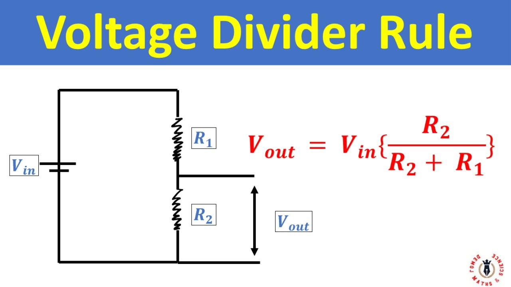

## What is Relation between Voltage, Resistance and Current?
The relation between voltage (V), current (I) and resistance (R) is given by Ohm's Law:
> V = I x R

- Voltage (V) measured in volts is like the "pressure" pushing electric charges through a circuit. water pressure.
- Resistance (R) measured in ohms is the opposition to the flow of electric current. Like someone putting / applying pressure on pipe using leg / hand. thickness/narrowness of the pipe. 
- Current (I) measured in Amphere is the flow of electric charges (like water flow in a pipe). in water it is Liters per second. in Electric Current it is Amphere ( 1 A = 1 Coulomb per second ). 1 Couloumb = 6.242 x 10 power 18 electrons.

## What is voltage divider? How resistance reduces voltage? How to calculate voltage?
**Voltage Divider** is a circuit that uses resistors to reduce a larger input voltage to a smaller output voltage. A Voltage Divider consists of two resistors connected in series accross a voltage source. The Output Voltage is taken from the connection point between the two resistors.

**Formula** Vout = Vin x (R2/(R1+R2))
- The output voltage is always a fraction of input voltage
- It R1 = R2, then Vout = Vin /2 (Half the input Voltage)
- Larger R2 relative to R1 gives higher output voltage
- Larger R1 relative to R2 gives lower output voltage
- The circuit works because voltage diveds proportionally based on resistance ratios.

## What is Power?
Power is rate at which energy is transferred, used or converted. Power measured engery per unit time. Measured in watts(W), 1 Watt = 1 Joule per Second.
> Power (P) = Energy / Time

> Power (P) = Voltage(V) x Current (I)

- 10W LED converts 10 Joules of electrical energy into light every second
- 5W phone charger delivers upto 5 joules per second to charge battery

> Power = Water Wheel Work Rate. Water Wheel Power depends on How fast the water flows (current/amps) and How much pressure pushes it (Voltage / volts).

> Rate at which work done. 3W speaker, 1200 W Induction stove, 10 W LED Light.

## What is Joules?
A Joule is a specific amount of energy. 
- Power (Watts) = How fast trucks deliver Cargo (Boxes per Minute)
- Energy (Joules) = Total cargo delivered (total number of boxes)
> Phone Battery
>
> Phone Battery stores about 50,000 joules of energy. Thats like haveing 50,000 boxes in warehouse. A 5W Charger delivers energy at 5 Boxes per second. Takes about 3hours to fill warehouse : 50,000 / 5 = 10,000 seconds

> Total work done, like Kilo Watt Hour. or Joule

## Why does Phone Battery says 5000 mAH, instead of Joules?
Energy stored is same, but different voltages causes different discharge times.
Like 5000 litrs stored at 3.4m height vs same 5000 liters water tank at 9m. 9m  water tank discharges faster due to higher voltage. In phone it can supply 5000 milli amps for 1 hour or 1000 milli amps for 5 hours or 500 milli amps for 10 hours. Rate depends on voltage. 

## Why does Electricity bills uses kWH instead of Joules?
1 kWh = 3,600,000 joules (3.6 million joules!)
> Think: "I ran a 1500W heater for 10 hours = 15 kWh". Much easier than: "I used 54,000,000 joules of energy".

## What is difference between UART vs I2C vs SPI Protocols? 

| UART | I2C | SPI |
| --- | --- | --- |
| Universal Async Rx Tx | Inter Integrated Circuit | Serial Peripheral Interface |
| 2 Pins | SDA, SCL | MISO, MOSI, CS, CLK |
| 115200 baud | 400 kHz | 10 MBPS |
| Async | Sync | Async |

